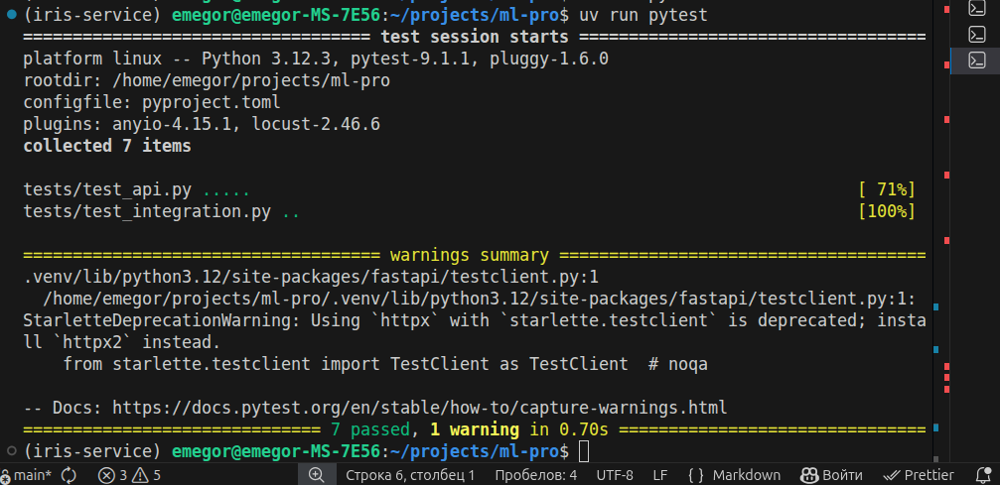
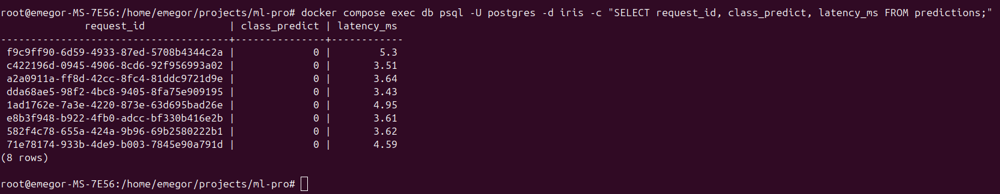
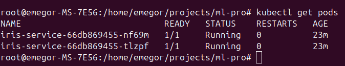
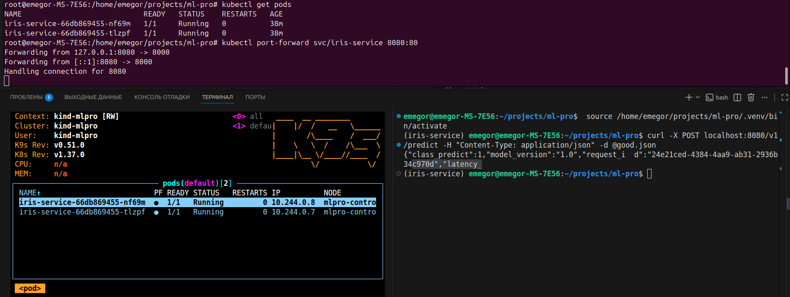

# ml-pro HW1
## Основное
### Команды
#### Тесты
`uv run pytest`



#### Docker Compose
`docker compose up ‐d ‐‐build`



#### k8s

```
kind create cluster --name mlpro && 
kind load docker-image iris-service --name mlpro && 
kubectl apply -f k8s/ && 
kubectl get pods
```





### Журнал

В моедли входных данных `Features` забыл прописать `model_config = {"extra": "forbid"}` из-за этого не проходили соответсвующие тесты, не сразу понял в чем дело.

## Звездочки

...